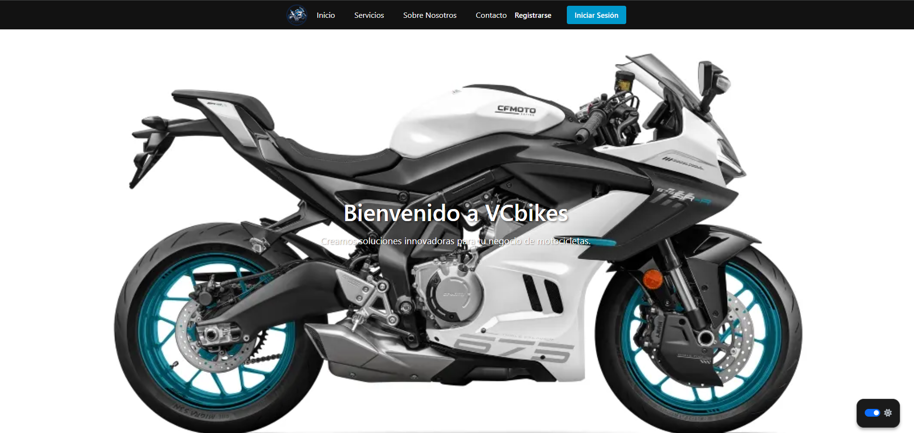

## Proyecto de Gestión de Inventarios y Ventas

Este proyecto es una aplicación web para la gestión de inventarios, empleados, proveedores, clientes y ventas de productos.

### Tecnologías Utilizadas

- Python
- Flask
- SQLAlchemy
- SQLite
- HTML
- CSS
- JavaScript

<<<<<<< HEAD

=======

>>>>>>> 6f07bd49dd7e2fe5a699ea9ce8ecdf79de2c83fa
